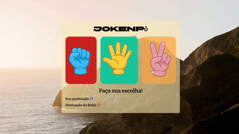
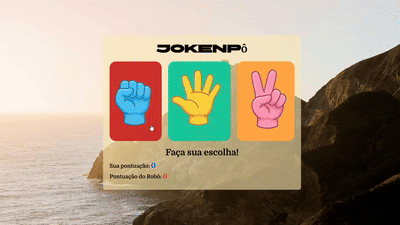

# 🪨📄✂️ Pedra, Papel e Tesoura — Jogo em JavaScript

Projeto desenvolvido com **HTML, CSS e JavaScript puro**, com foco em **lógica de programação**, manipulação do DOM e controle de estado da aplicação.

O jogo simula uma partida entre o usuário e o computador, que realiza escolhas aleatórias. A partida é encerrada automaticamente quando um dos jogadores atinge a pontuação máxima.

---

## 🎮 Demonstração do Jogo

  

  

---

     

## 🧠 Regras do Jogo

- Pedra vence Tesoura
- Tesoura vence Papel
- Papel vence Pedra
- Escolhas iguais resultam em empate
- Cada vitória concede **1 ponto**
- O jogo termina ao atingir **3 pontos**

---

## ⚙️ Funcionalidades

- Interface interativa com botões
- Escolha aleatória do robô
- Sistema de pontuação em tempo real
- Exibição visual das escolhas (GIFs)
- Mensagens de resultado a cada rodada
- Encerramento automático da partida
- Bloqueio de ações após o fim do jogo
- Botão de reinício
- Indicação visual do vencedor

---

## 🛠️ Tecnologias Utilizadas

- **HTML5** – Estrutura semântica
- **CSS3** – Layout, responsividade e efeitos visuais
- **JavaScript (Vanilla)** –  
  - Funções
  - Condicionais
  - Eventos
  - Manipulação do DOM
  - Controle de estado do jogo

---

## 📂 Estrutura de Pastas
<h2>👨‍💻 Autor</h2>

Victor Dantas

📌 GitHub: https://github.com/vic530

